# Locus

Keep every experience you have on file. For each application, tick the ones
that fit, order them, and export a one-page PDF.

*Locus* is Latin for a place or a position — and, by extension, an opening.

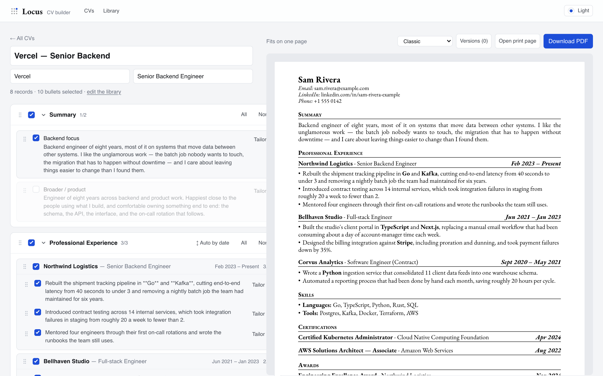

## Why

Tailoring a CV in Word means copying, deleting and re-indenting until the
spacing gives up. The work you actually want to do — *which three bullets
matter for this job* — gets buried in formatting.

Locus splits those apart. Your writing lives in a **library** you edit once. A
**CV** is a selection over that library: which records, which bullets, in which
order. Change a bullet's wording in the library and every CV that uses it
updates. Tick a box and the page re-renders as you watch.

## Getting started

```bash
npm install
npm run dev
```

Then open <http://localhost:3210>.

Your data lives in `data/locus.db`, a SQLite file that is gitignored. On first
run it is seeded with a small fictional sample so there is something to click;
edit or delete all of it in the library once you have added your own.

Requires Node 20+. The first `npm install` downloads a Chromium build for
Puppeteer, which is what renders the PDF.

## What it does

### Pick and order, per application

Every record, bullet and skill has a checkbox. Sections, records, bullets and
skills all drag to reorder. Experience defaults to reverse-chronological by end
date, with ongoing roles first; dragging a record switches that section to
manual order for that CV only, and `↕ Auto by date` switches it back.

The preview is live and tells you whether you still fit on one page.

**Tailor** rewords a bullet for one application without touching the library,
so the master copy keeps its own wording.

### Seven document styles

Chosen per CV, so a different look can go to a different employer. All of them
are near-black on white.

| | | |
|---|---|---|
| **Classic** — Garamond, hairline rules | **Ledger** — ruled headings, no entry rules | **Quiet** — centred, rule-free |
| 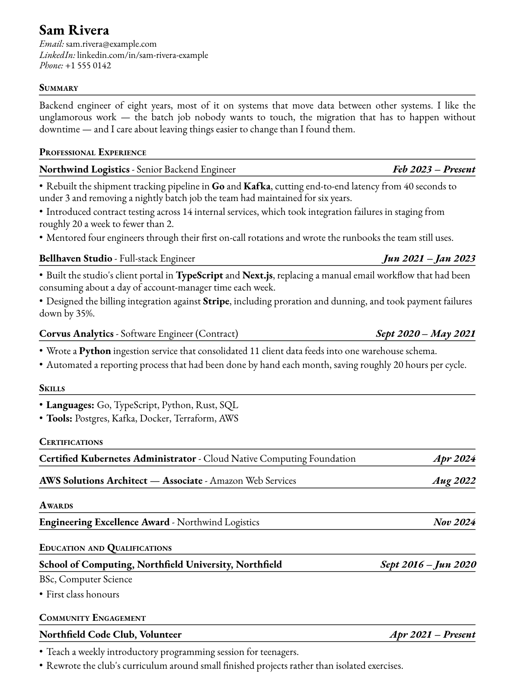 | 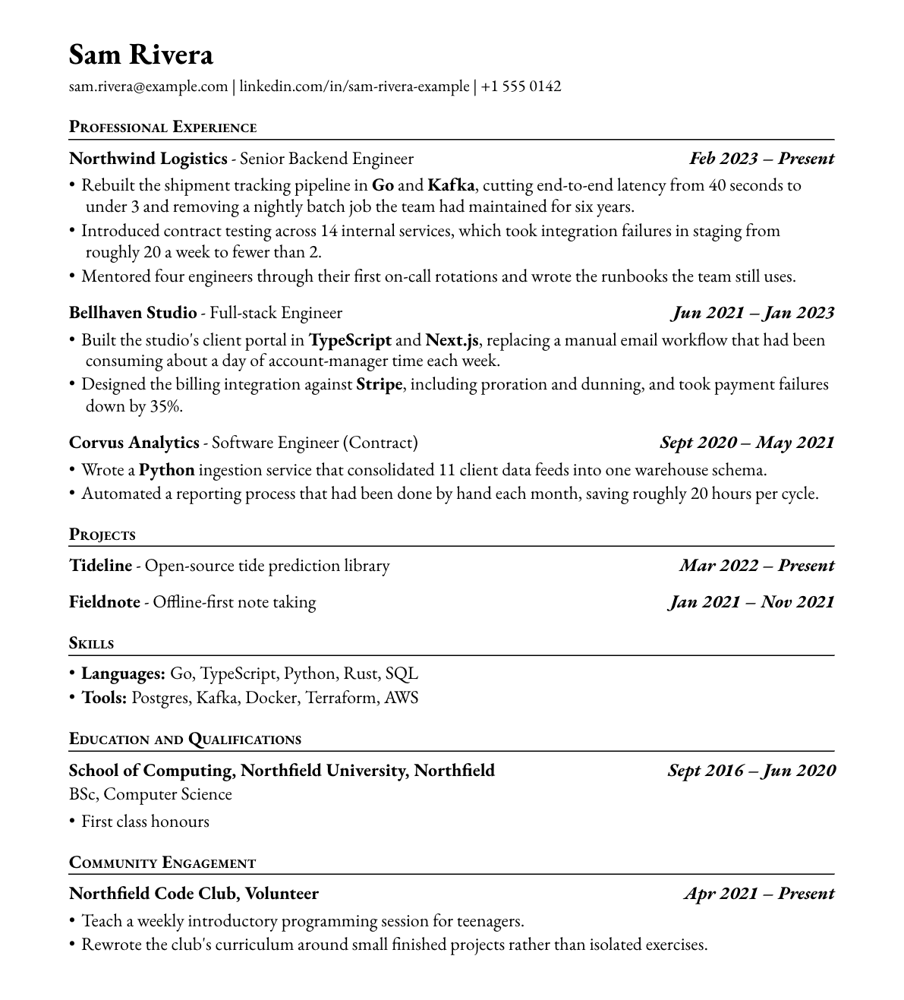 | 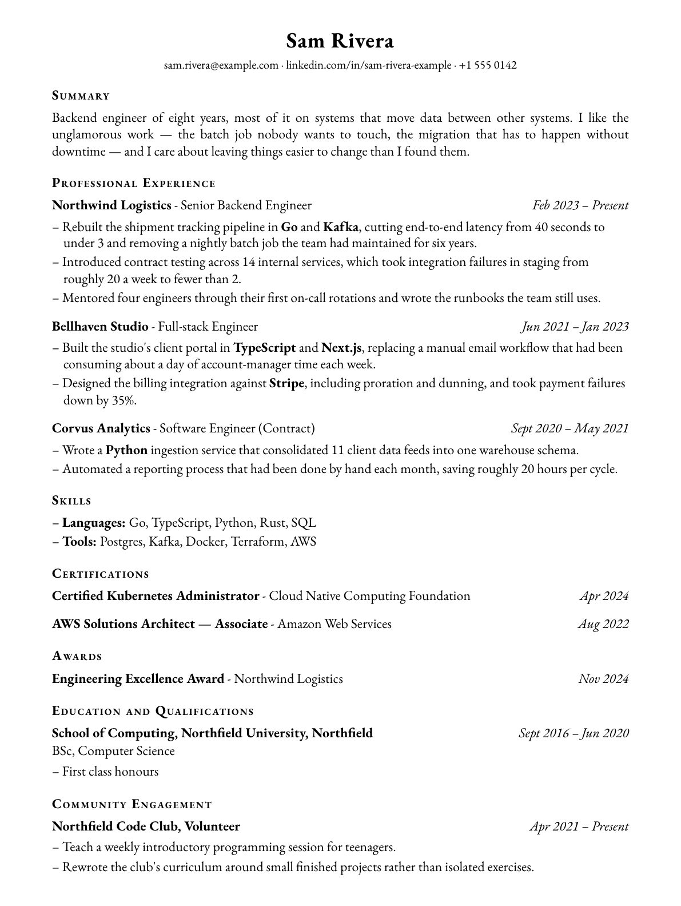 |
| **Margin** — headings in the left margin | **Modern** — Inter, tracked capitals | **Open** — Open Sans, airy |
| 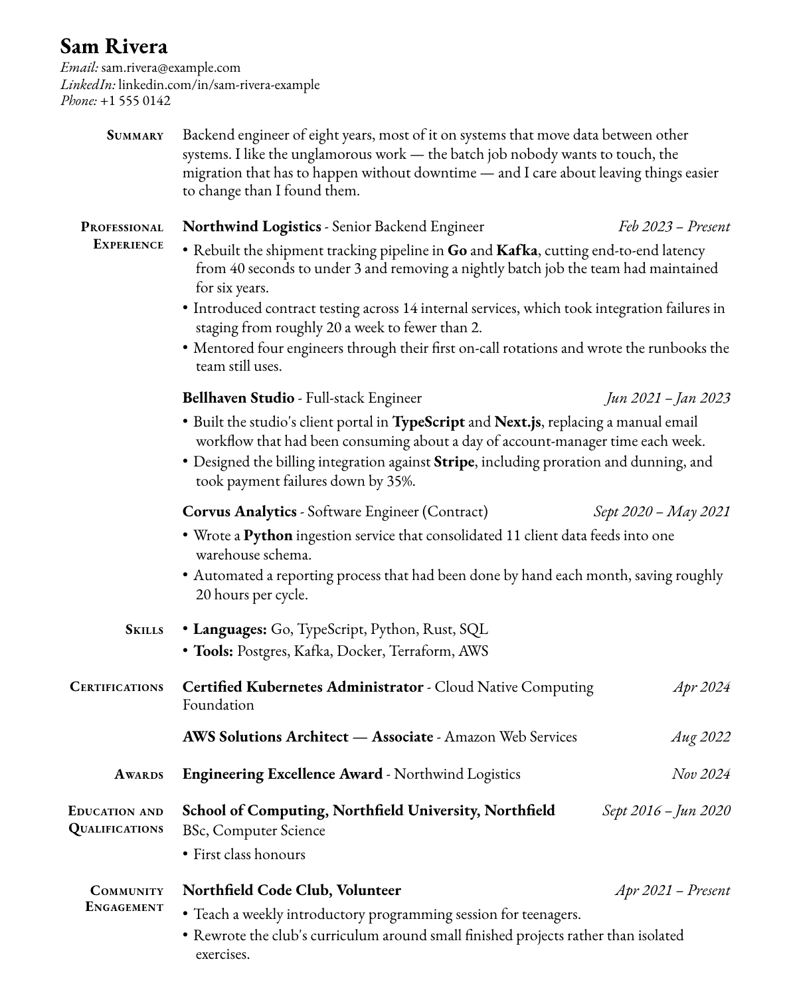 | 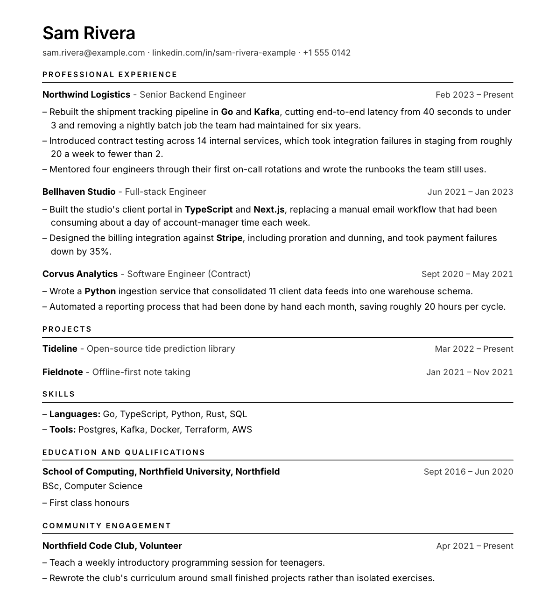 | 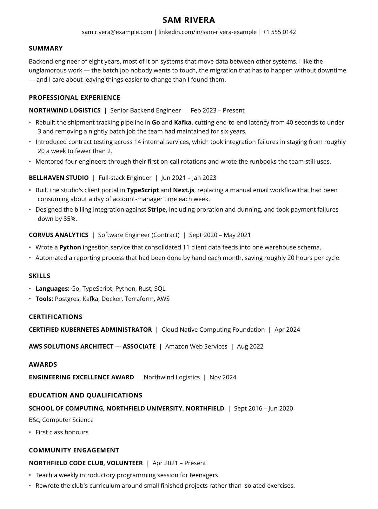 |
| **Slate** — Merriweather, role above employer | | |
| 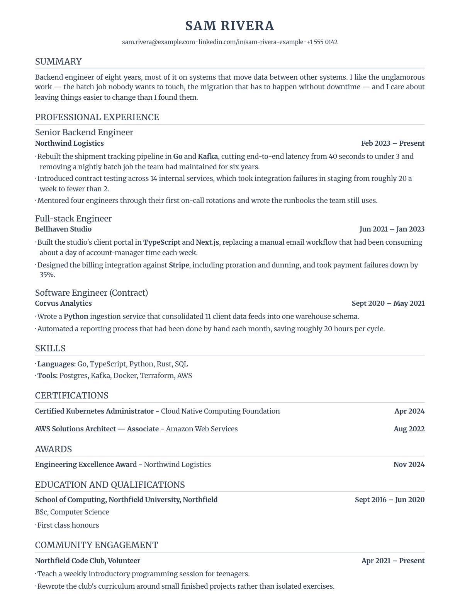 | | |

### Every download is kept

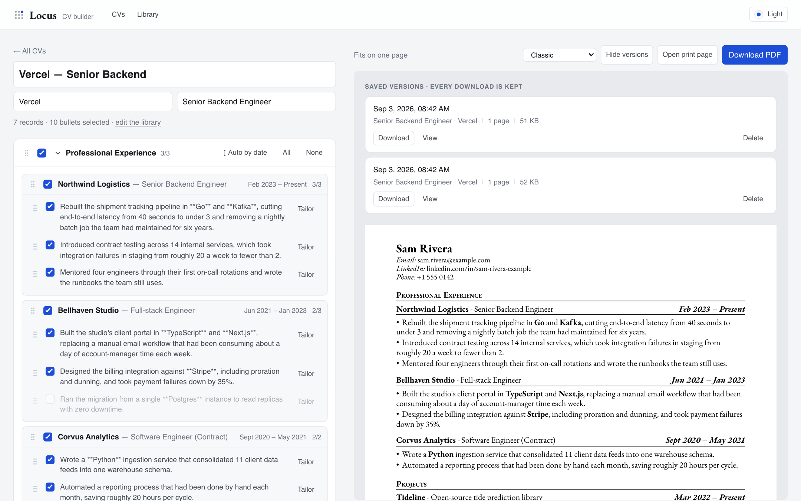

Each export is archived with a **snapshot of what it said**, so an old version
keeps its wording and its style even after you rewrite the library. Useful when
someone calls about an application from three months ago. Re-downloading an
unchanged CV bumps a counter rather than adding a duplicate.

### Twelve themes

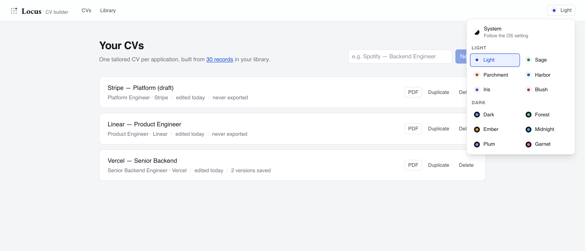

One light key and one dark key per hue — Light/Dark, Sage/Forest,
Parchment/Ember, Harbor/Midnight, Iris/Plum, Blush/Garnet — plus System.

Themes never reach the document. A CV is a printed page, so it stays black on
white in every palette, and the export is identical whichever theme you use.

### The library

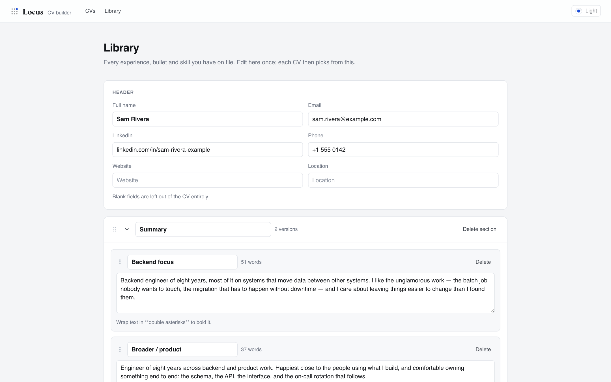

Add your own sections in any of the layouts described below — a summary,
certifications, awards, publications, referees. Wrap text in
`**double asterisks**` to bold it inside a bullet or a summary.

## How it fits together

A CV is a *selection over* the library, not a copy:

```
section  (Summary, Professional Experience, Certifications, Skills, …)
├── entry        (Northwind Logistics — Senior Backend Engineer)
│   └── bullet
├── skill_group  (Languages)
│   └── skill
└── prose        (one version of your summary)
```

Sections come in three layouts:

| Layout | For | Prints as |
| --- | --- | --- |
| **Dated records with bullets** | Experience, Education, Projects | Organisation, role, date range, bullets |
| **Records with one date** | Certifications, Awards, Publications | The same, with a single date instead of a range |
| **Records with no dates** | Referees, Interests | The same, with no date at all |
| **Inline skill lists** | Skills, Languages, Tools | `Languages: Go, TypeScript, …` |
| **A paragraph** | Summary, Profile, Objective | A block of prose |

A prose section can hold **several versions of the same paragraph** — one
angled at backend work, one at leadership — and each CV picks the one that
fits. They are alternatives, so a new CV starts with the first ticked rather
than all of them stacked. Like bullets, a summary can be tailored for one
application without touching the library copy.

The `cv_*` tables store only where a CV **deviates** from the default — a
missing row means "included, in library order". Two consequences worth knowing:

- Records added to the library later appear in existing CVs automatically.
- Editing a bullet updates every CV that uses it, unless that CV has tailored
  it, which wins locally and never touches the library.

### The document

`src/lib/cvStyles.ts` is the whole visual specification, in points. The base
metrics came from a real Word CV: A4, 45.35pt side margins, 12pt body,
small-caps section headings, 0.5pt rules.

The live preview and the PDF go through **one** component and **one**
stylesheet, so they cannot drift: `/print/<id>` is the bare document page, and
the PDF route drives headless Chrome over it. A style is a block of CSS layered
on the shared base and selected by a `data-style` attribute — no separate
templates to keep in sync.

Fonts ship as dependencies rather than relying on what is installed, and the
PDF route checks the style's font actually loaded and fails loudly rather than
quietly emitting a substitute.

#### Shared vertical rhythm

Spacing is declared once on `.cv-page` and styles override only what they need:

```
--cv-lead          line-height multiplier
--cv-gap-bullet    between consecutive bullets
--cv-gap-entry     between records
--cv-gap-section   between sections
--cv-gap-title     under a section heading
--cv-gap-head      under an entry heading
```

`--cv-lead` is deliberately *not* the same number across styles. Garamond's
x-height is about 40% of its em against roughly 55% for Inter, Open Sans and
Merriweather, so an identical multiplier would leave the serif styles cramped
and the sans ones loose. The multipliers are tuned so leading divided by
x-height lands in a narrow band instead.

## Schema changes

`src/lib/schema.sql` is what a brand new database gets. `src/lib/migrations.ts`
is what an existing one gets — numbered steps applied in order and recorded in
SQLite's `user_version`, so each runs exactly once. Both run on startup; there
is no separate command to remember.

Adding a change means doing two things:

1. Edit `schema.sql` so new installs get it.
2. Add a migration so existing installs get it. Keep the `up` guarded and safe
   to re-run — databases created before the ledger existed sit at version 0
   with the changes already applied and must survive a replay.

Then run the check:

```bash
npm run check:migrations
```

It builds one database from `schema.sql` and another from each released
baseline in `test/baselines/` plus every migration, and asserts the two end up
with the same schema. Forgetting step 2 is the easy mistake, and it is
invisible until someone who installed months ago hits a missing column — this
is what catches it.

When you cut a release that changes the schema, drop that version's
`schema.sql` into `test/baselines/` so future upgrades keep getting tested from
it.

## Layout

| Path | What it is |
| --- | --- |
| `src/lib/schema.sql` | Tables, with the overlay design explained inline |
| `src/lib/migrations.ts` | Ordered schema changes for existing databases |
| `src/lib/queries.ts` | Reads: library, builder state, resolved document |
| `src/lib/resolve.ts` | Pure selection → document. Runs on server and client |
| `src/lib/actions.ts` | Every write, as server actions |
| `src/lib/cvStyles.ts` | The document stylesheet and its seven styles |
| `src/lib/themes.ts` | Theme metadata; palettes live in `globals.css` |
| `src/lib/exports.ts` | The saved-version archive |
| `src/components/CvDocument.tsx` | The document itself |
| `src/app/(app)/` | The editing UI |
| `src/app/(print)/` | Bare print targets for Puppeteer |

The builder holds its own state so the preview reacts instantly, and fires each
change at the server in the background; selection actions deliberately do not
revalidate the builder route, which would fight your typing.

## Screenshots and demo data

`npm run dev:demo` runs against a throwaway `data/demo.db` on port 3211, seeded
with the fictional sample. With it running, `npm run screenshots` regenerates
everything in `docs/screenshots`. Both exist so documentation never contains
real data.

## Releases

See [CHANGELOG.md](CHANGELOG.md). Every version gets an entry.

## Not done yet

Tracked in [issues](https://github.com/Elisha-Veve/locus/issues). The ones that
matter most:

| | |
| --- | --- |
| [#1](https://github.com/Elisha-Veve/locus/issues/1) | Data lives in one gitignored SQLite file with no export. Lose it and everything goes. |
| [#2](https://github.com/Elisha-Veve/locus/issues/2) | Deleting a library record silently changes CVs that already used it. |
| [#3](https://github.com/Elisha-Veve/locus/issues/3) | Desktop only — no mobile layout yet. |
| [#4](https://github.com/Elisha-Veve/locus/issues/4) | Nothing runs on push; the checks exist but are manual. |
| [#5](https://github.com/Elisha-Veve/locus/issues/5) | An archived version can be viewed and re-downloaded, but not restored onto a CV. |

[#10](https://github.com/Elisha-Veve/locus/issues/10) is a small, self-contained
place to start if you want to change something.
